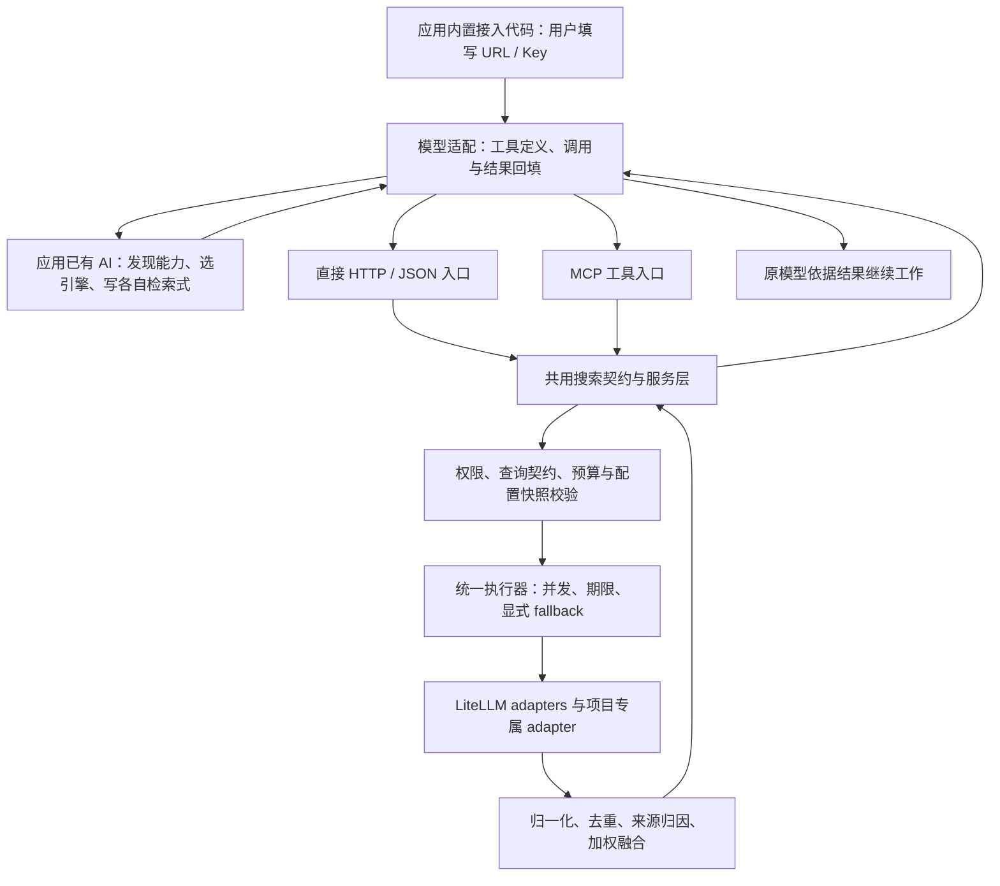

# 全球主流 LLM 搜索接入协议优化计划

> 实施更新：按本计划已交付 P0–P2 的源码、客户端、MCP、去重与运营限制，详见[协议交付](../smart-search-router/protocol/README.md)和[验证报告](../smart-search-router/protocol/verification.md)。下文保留制定时的设计语境；真实跨厂商模型/宿主闭环因凭据缺失仍待验收，不能将源码交付视为全球发布门槛全部通过。

## 通俗解释：应用内置一次，用户只填地址和密钥

你希望全球应用开发者接入一段标准代码，应用原有的 AI 就能使用 bensz-search；用户新增的配置只有搜索服务 URL 和 Key，不需要安装插件、学习各搜索引擎 API 或再购买一份规划模型服务。

例如，一个使用 Claude 的科研聊天应用需要查找文献：AI 得知当前有哪些可用搜索引擎，选出合适的几个，分别写查询；bensz-search 执行这些查询，合并重复文献，返回带来源的标准结果，Claude 再据此回答。换成 Gemini、Grok、DeepSeek 或本地 Qwen，仍然调用同一套搜索服务。

现在，应用已经能凭 URL 和 Key 调用搜索，但 AI 还拿不到完整的能力说明，也不能一次提交“不同引擎分别用不同查询”的计划。改进后，应用内置的接入代码自动完成这些步骤，终端用户只看到搜索正常工作。

这里的“只填 URL 和 Key”指新增搜索配置；应用仍使用它已有的模型账号、模型地址或本地运行环境。bensz-search 服务管理员负责配置真实搜索源，客户端不接触这些源的密钥。

应用可以内置直接 HTTP 接入代码，也可以内置 MCP 客户端。MCP 本身不等于插件；开发者把接入能力放进应用后，终端用户仍只填写对应入口的 URL 和凭据。

## 专业判断：已有执行基础，缺少完整接入契约

审计依据为当前工作区，Git 基线 `ecd805370c1527ebd4b8ef460b96555e7b85ff39`，包括已有未提交改动，LiteLLM upstream 为 `1.103.2` 发行包。详见 [现状审计](../smart-search-router/protocol-readiness-audit.md)。本计划新增接口与适配器均为**拟议能力，尚未实现**。

| 环节 | 已有基础 | 本计划补齐 |
|---|---|---|
| 简单调用 | 搜索 POST、URL + Bearer Key | 可嵌入代码、完整协议规范 |
| 发现 | 内部能力表、后台配置、原生工具列表 | 应用 Key 可访问且按权限过滤的能力快照 |
| 选引擎 | auto 的六意图规则、显式单工具 | 外部 AI 选择任意受限子集或明确全选 |
| 写检索式 | 通用 query、provider 参数映射 | 每调用项的 query、方言和安全选项契约 |
| 执行 | 并发、超时、fallback、预估预算、熔断 | 外部计划验证、逐调用执行、正确的引擎归因 |
| 去重融合 | URL 去重、weighted RRF、source_family | 常态来源链、重复原因、按需论文标识识别 |
| 返回 | LiteLLM 统一结果 | 协议版本、状态、错误、成本依据和内容类型 |
| 模型接入 | 应用可自行请求 HTTP | 跨厂商工具适配和完整调用循环 |
| 全球交付 | 本地 Docker 产品 | 英文指南、区域/语言行为、真实兼容矩阵 |

P0 应补齐能力发现、外部计划执行和跨模型接入契约。把 LLM planner 搬到服务端不能单独解决这些缺口，而且会给已有 AI 的应用增加配置、费用与延迟。

## 定位：搜索接口与工具契约如何结合 MCP

本计划中的“bensz-search 协议”，具体指版本化的搜索 API、工具数据契约和使用规则。通用工具发现与调用可以复用 MCP；bensz-search 定义自己的搜索行为与数据格式。

MCP（Model Context Protocol）负责标准化应用与工具服务之间的通信。bensz-search 的搜索契约负责说明有哪些搜索引擎、各自支持什么查询、怎样提交多引擎计划，以及结果如何归一化、去重和融合。两者可以结合使用：MCP 承载同一套搜索工具契约。

| 比较项 | MCP | bensz-search 搜索契约 |
|---|---|---|
| 通信与工具调用 | 工具发现、输入 schema、调用与结果传递等通用机制 | HTTP API 及其搜索请求/响应，或经 MCP 传递的同一数据 |
| 能力发现 | 告诉宿主应用有哪些工具及其说明 | 告诉 AI 当前有权使用哪些搜索引擎、查询规则和限制 |
| 模型决策 | 宿主把工具信息交给模型，模型决定使用方式 | 提供任务适配、来源、语法和预算信息，帮助模型选源与写查询 |
| 检索与融合 | 不规定具体搜索算法 | 校验并执行计划，去重、weighted RRF、归一化和来源归因 |
| 用户操作 | 由宿主应用提供接入与配置方式 | 应用内置后，新增搜索配置为对应入口 URL 和凭据 |

采用 MCP 后，AI 仍需看到工具用途、动态引擎能力和可信使用规则。“选择几个引擎、分别写什么查询、是否补充检索”由应用原有模型判断；权限、参数、预算和调用上限由代码落实。MCP 的工具发现不会自动完成这些搜索决策。

实施采用一套搜索服务、两种接入入口：HTTP API 服务于直接集成；MCP 入口服务于已有 MCP 宿主与生态。两种入口复用逻辑工具、能力配置、身份权限、查询校验、执行器、融合和业务结果模型。新增入口不引入额外规划模型或独立搜索策略。

无需终端用户安装插件是产品交付要求。开发者可以内置 HTTP client，也可以内置 MCP client；应用仍须完成工具注册、凭据传递与模型调用循环。支持 MCP 不能替代针对具体宿主认证方式、协议版本及工具调用能力的验证。

## 要达到什么目标

- 核心搜索契约公开且版本化，独立于模型供应商、SDK、语言和 Agent 框架；直接 HTTP/JSON 与 MCP 两种入口共享其搜索语义。
- 应用开发者内置一次接入代码，终端用户只设置搜索服务 URL 和 Key；SDK 可以是应用依赖，不能要求用户另装插件。
- 同一逻辑工具契约支持 OpenAI、Anthropic、Gemini、Grok、中国大陆模型和自托管模型；不具备工具调用能力的模型有可观察的备用路径。
- AI 可以选择全部或部分当前有权限的引擎，对各引擎生成不同查询；服务端确认合法后执行、归一化、去重、融合。
- 调用方始终能判断搜索成功、部分成功、无结果或失败，并获得来源、实际执行情况和是否满足约束的说明。
- 现有 `/search`、原生显式 provider 路径、后台与 LiteLLM adapter 保持兼容，小范围增加独立模块。

本次后续实施范围不包含强化学习、向量数据库、大型数据库、复杂工作流语言、搜索全文抓取或语义答案生成。搜索缓存和服务端 LLM planner 留到有数据证明其必要性时考虑。

## 总体设计



模型适配只转换工具消息格式，不重复实现搜索策略。核心服务不需要知道调用它的是 Claude、Gemini 还是一个普通脚本。

每次调用使用应用所配置的一种入口；图中的两条路径表示接入选择，同一计划只执行一次。服务返回结果由相应入口封装并交回宿主，再由宿主交给模型。

### 统一逻辑工具

建议对 AI 暴露两个逻辑工具：

- `bensz_search_capabilities`：读取当前有权限的引擎、能力、查询规则和限制。
- `bensz_search`：执行自动搜索或外部 AI 生成的结构化计划。

参数和结果使用同一套逻辑数据定义，各适配器将它转换为对应厂商接受的格式。能力快照由接入层短期缓存，失效后刷新，避免每次搜索多一次往返。

MCP 的 `tools/list` 暴露上述两个工具的定义，`tools/call` 调用它们。具体搜索引擎及其查询契约由 `bensz_search_capabilities` 的结果提供；不把每个引擎都展开成一个 MCP 工具，也不把工具列表当成引擎能力快照。

不要为每个 provider 注册一个常驻 LLM 工具：新增 provider 应通过能力发现生效，不要求所有客户端升级，也避免大量工具定义占用模型上下文。

### AI 如何获知流程并与服务互动

URL 和 Key 只能让接入代码访问服务，不能让 AI 自行理解搜索流程。应用必须在模型实际收到的上下文中注册带用途说明的工具定义、可信的短交互规则，并通过工具结果交付动态能力清单。模型据此决定是否需要外部证据、选择引擎、为各引擎生成查询，再根据实际搜索结果决定是否补充检索。

本计划因此同时交付 HTTP/JSON 协议、逻辑工具契约和交互规则。接入代码运行“发现→模型规划→执行→结果回填→模型复核”的有界循环；服务端静态校验、权限与预算是代码约束。跨轮总预算由宿主控制，不能每次搜索重置；模型不遵守提示时也不能绕过这些限制。

使用 MCP 时由宿主承担工具发现、模型信息传递、调用与结果回填；搜索决策和跨轮限制保持相同语义。已有宿主负责的调用循环直接复用，避免再嵌套一个 Agent 循环。

完整消息顺序、初始工具说明、状态机与错误修正见 [AI 与 bensz-search 的交互协议设计](../smart-search-router/agent-interaction-protocol-design.md)。此交互层尚未实现，不能将现有 auto 规则规划视为外部模型已经知道或完成这些步骤。

## 改进方向

### 能力发现：让 AI 知道它实际能用什么

拟新增 `GET /bensz-search/v1/capabilities`，由普通应用 Key 访问。返回当前身份有权使用的已启用工具及其可查询引擎，不泄露 provider Key、内部地址、其他用户或后台配置。

必须区分三种标识：

- `tool_id`：管理员配置的服务实例，多个同类型实例可以并存。
- `provider_type`：Brave、Tavily、SearXNG 等 adapter 类型。
- `engine_id`：某实例内可单独选择的底层引擎；SearXNG 的 PubMed 与 GitHub 不能被误当成同一个检索语法。

聚合源未公开底层引擎时只呈现为一个工具，不虚构独立引擎。SearXNG 的引擎仅在“管理员允许、实例支持、adapter 可选择”有证据时标注可选择；必要的实例元信息由服务器同步，不能要求调用方提供任意地址。复用配置选项及已验证实例元信息即可，不建立新的爬虫系统。

每个项目应提供：适用任务、输入形式、查询方言、支持/不支持/未知的参数、结果与查询长度限制、成本依据、超时、来源族与独立性可信度。能力分数标明配置先验，不能包装成实测质量。

可用性同时表述：配置已启用、凭据就绪、是否在冷却期、最近探测时间与结果。未探测标为 unknown；`/ready` 有配置不能等同于外部引擎现在能返回结果。能力发现不自动向所有 provider 发起付费测试。

快照携带 `registry_revision`、生成时间、缓存期限、协议版本与系统限制。发现接口和执行接口使用同一权限来源，包括原生 key/team 交集；当前自有应用 Key 仍可保持“全部启用配置”的行为。

**用户变化：** AI 不再凭名称猜引擎功能，也不会尝试未配置、无权限或已知暂不可用的服务。

### 查询契约：让 AI 为每个引擎写合适的查询

为每个工具/引擎配置轻量 QueryContract，包括：

- 推荐输入是关键词、自然语言还是已验证的领域检索式。
- 明确支持的运算符、引号/布尔表达式规则、长度与条数上限。
- 允许的安全选项，以及参数由 provider 原生实现、服务端后过滤或目前不支持。
- 好例子、常见错误、证据来源和最后核验时间。

不能把 PubMed 名称当作“完整 PubMed 布尔语法已通过 SearXNG adapter 验证”的证据；要检查整条 adapter 调用链及真实输入/响应。未验证的能力标为 unknown，默认用普通关键词。

“合法”分为结构合法、当前 adapter 明确支持、执行符合权限/限制三层。服务端能检查长度、字段、已知方言和枚举；无法静态保证所有供应商语义正确、论文检索完整或所有平台政策自动满足。供应商限制由维护者据官方规范更新，不向 AI 作绝对保证。

AI 在调用方生成查询；服务端不默默改写查询。无效计划返回字段位置、稳定错误码和安全的修正建议。`dry_run` 可校验计划、估算成本并告知约束变化，不调用付费搜索。

**用户变化：** 查论文、查代码、查新闻可以使用各自适合的表达方式，并在执行前识别明显不受支持的查询。

### 外部计划执行：一次提交 n 个引擎与各自查询

拟新增 `POST /bensz-search/v1/search`，支持两个模式：

- `auto`：复用现有规则规划，适合普通程序或没有能力生成计划的模型。
- `planned`：调用方提交 `calls[]`，各项包含唯一 call_id、tool_id、可选 engine_id、query、结果数量和受限 options。

planned 允许同一个配置的不同底层引擎使用不同查询，也允许同一工具的少量不同查询。必须明确“一次物理调用”和“一个工具”的区别，预算按实际调用数计。逐 adapter 确認 query list 的展开方式；不能把列表当成零成本批量能力。

调用方全选时明确列出能力快照中可选项目；不默认执行所有源。服务器发布调用数、并发和结果上限，建议起始值为每请求最多 10 个调用项、3 个并发，均可配置。全部源超过上限或预算时给出明确拒绝/修订要求，不静默截断，也不承诺无限制并发。

服务端先校验整个计划，再发起网络调用：未知工具/引擎、无权限、禁用配置、非法参数或预算不匹配，均不能先检索一部分再报输入错误。服务端配置决定地址、凭据、来源族和执行上限；AI 不得提交这些字段。

`registry_revision` 过期且会影响查询契约/授权时返回可重试的 `stale_capabilities`，客户端刷新后重新规划；执行时再次鉴权，读取一致配置快照。已被撤销的 key 和已停用的工具不可凭旧快照执行。运行期健康变化作为明确跳过/失败状态，不能强行调用熔断中的引擎。

**用户变化：** AI 决定的“搜哪几家、各搜什么”可以原样交给服务执行，调用方只处理一次标准响应。

### Fallback、预算与速度：让执行结果符合 AI 的计划

重构现有执行器，使规则计划与外部计划共享执行、取消、错误分类和日志逻辑，不复制另一套 SmartRouter。

planned 默认只执行提交的调用项。替代源必须由调用方声明或明确允许服务端规划；替代源需有自己的合法 query，不能把 PubMed 表达式盲目转发给网页搜索。若需重新写查询，返回 `replan_required`，交给原模型处理。

所有调用共享截止时间、预估成本预留和并发限制；失败请求可能计费，fallback 也必须计入。明确数值预算不能保证供应商实际账单，尤其模型型搜索源的 token/tool 计费需要单独标注。暂不把配置估算提升为严格计费承诺。

区分输入错误、权限错误、限流、余额不足、超时、网络错误、响应格式错误和成功但零结果。部分成功返回已取得结果；全部健康调用零结果返回 `no_results`，全部调用失败返回标准错误。零结果是否触发 fallback 应由模式和参数明确决定。

速度先通过能力缓存、有限并发、流式模型工具回填、超时和结果体积控制改善。候选量已足够时提前取消可能损害独立来源覆盖，列为后续按质量 benchmark 决定的可选策略；深度检索仍受总期限约束。

**用户变化：** AI 能知道哪些搜索真正完成、哪些失败，也能决定是否再搜，避免一次计划扩展为不可预测的调用费用。

### 标准结果：默认就有来源、状态与内容类型

新协议 envelope 至少包括 `protocol_version`、`request_id`、`status`、`results`、`execution`、`warnings` 与成本依据。不要让调用方为判断部分失败而必须打开 debug。

每条结果包含稳定 result_id、title、url、canonical identity、snippet、日期和来源列表。来源列表说明 call_id、tool_id、engine_id（已知时）、原始排名、来源族及其依据，融合分数说明是排序贡献而非事实可信度。

正常响应中的执行摘要列明 requested/executed/skipped/failed 的调用项、延迟、结果数和机器可读错误码。debug 只补充解释，不改变必需信息；失败 envelope 同样包含 request_id 和脱敏摘要。

区分页面摘录、搜索摘要、模型生成摘要和仅有来源链接。当前 OpenAI 搜索源已有 snippet_kind，应推广到所有响应；合并时不能把生成摘要补进摘录字段后丢失其类型。日期冲突和不受支持的筛选条件显式给 warnings。

结果正文标为不可信外部内容，模型适配的工具说明要求把它作为证据数据处理。限制单条片段和总响应体积，提供可观察的 truncated 标记，避免任意网页片段挤占模型上下文。

保留现有 URL 去重和 family-aware weighted RRF。多查询、多配置或聚合源命中同一文献时，不能把每个 call_id 都当作独立来源票。先实现确定性去重；若正规学术元数据包含 DOI/PMID/arXiv ID，再以保守规则合并并保存别名，不能仅凭标题相似度跨站合并不同版本。

**用户变化：** 模型能直接引用结果来源，知道摘要是什么、搜索覆盖到哪里，以及结果是否完整。

### 跨模型适配：统一搜索语义，处理不同工具消息格式

提供 TypeScript 和 Python 的轻量客户端与可复制最小代码。直接 HTTP 客户端只负责标准搜索 API 调用，不强制依赖模型 SDK；厂商适配器作为可选模块，应用构建时内置。MCP 接入使用宿主已有客户端或应用内置客户端，复用同一搜索契约。使用请求级凭据隔离，禁止全局单例在多用户间共用 Key。

适配器完整处理：工具声明、模型输出参数、流式参数组装、服务端执行、工具结果回填、继续生成、取消和循环上限。不能只导出 tools JSON 后声称接入完成。

| 接入族 | 首批覆盖对象 | 适配重点与验证边界 |
|---|---|---|
| OpenAI Responses | Responses 聊天/Agent 应用 | function_call / function_call_output、call_id、严格 schema、流式参数、推理模型必要上下文保留 |
| OpenAI Chat Completions 格式 | 原生接口、第三方兼容网关 | tools/tool_calls/tool 结果消息；兼容网关须逐版本验证，不能仅看接口名称 |
| Anthropic Messages | Claude 直接接口；后续托管渠道 | input_schema、tool_use/tool_result、并行工具块、文本与工具块顺序、错误结果 |
| Google Gemini | Gemini API；Vertex 渠道单列 | function declarations、functionCall/functionResponse、schema 子集及多轮所需签名/上下文 |
| xAI Grok | Grok 的已验证工具调用接口 | 使用相应 Chat/Responses 适配族，保留平台差异，不假设完全等同 OpenAI |
| 中国大陆模型 | Qwen、DeepSeek、GLM、Kimi、MiniMax；按需求扩展其它主流供应商 | 官方渠道和自托管渠道分别验证；工具支持、严格 JSON、流式与并行按具体模型/版本记录 |
| 自托管与开源模型 | vLLM、SGLang、Ollama、LM Studio；覆盖 Qwen/DeepSeek/GLM 等及 Llama/Mistral 家族，扩展至 Hunyuan、InternLM、Yi、Baichuan 等具体权重 | 检查模型权重、chat template、tool parser 与服务版本；“开源模型”本身不保证 function calling 可用 |
| Codex SDK/Agent 运行时 | Codex SDK 与 App Server | 单列 runtime adapter；当前官方 dynamicTools / item/tool/call 为 experimental，不把 Responses tools 参数套到所有 SDK |

直接集成应用使用上述厂商适配器；已具备 MCP 支持的宿主通过 MCP 入口取得相同搜索工具。宿主与模型之间的适配可以复用其已有能力，仍需验证实际模型闭环与搜索质量。

“全球主流模型兼容”分层验收：支持 HTTP 即可由应用集成；原生工具模型能自主闭环；只支持结构化输出的模型由宿主验证 JSON 计划并执行；完全不支持可靠工具/JSON 的模型可由宿主调用 auto 后把结果交回。最后一类不能宣称获得与原生工具模型同等的自主规划能力。

客户端通过实际能力配置和探测选择路径，不给不支持 tools 的模型强塞工具字段。错误或不完整参数不执行；必要时有限次数修正，仍不合法则返回可解释失败，不通过无限循环尝试完成。

**用户变化：** 换模型不会迫使用户重新安装搜索扩展；应用开发者选择一个适配族，搜索服务配置保持一致。

### MCP 接入：复用生态，保持两种入口行为一致

在核心搜索契约和 HTTP API 稳定后，增加轻量 MCP 适配入口，列入 P1 生态接入交付。它将 MCP 工具调用映射到同一服务层，复用已有校验、执行和结果处理；在服务内部直接调用共享组件即可，无需额外发一次内部 HTTP 请求。

两种入口必须具有相同的权限过滤、查询参数、预算、错误语义、来源与取消行为。MCP 按自己的工具结果格式封装业务结果，不把搜索失败混同为通信协议错误。能力快照与业务契约版本使用同一来源，MCP 协议版本则按标准单独协商与管理。

远程入口的传输、认证、生命周期和工具消息格式按实施时的 MCP 规范与 SDK 验证。应用 Key 可访问搜索能力，不能因此访问后台管理；撤销、停用与快照过期在两种入口都必须生效。文档区分 API URL 与 MCP 服务 URL，提供内置客户端所需的凭据传递方式，避免让用户猜测地址或修改工具参数。

**用户变化：** 普通应用和已有 MCP Agent 都能使用同一个搜索服务，搜索能力与结果格式保持一致。

### 面向全球：语言、区域、部署与稳定性契约

- 协议字段与错误码固定英文，公开规范和最小接入教程提供英文/中文；工具说明可按应用语言生成。
- 分开定义查询语言、期望结果语言、地区偏好和返回说明语言；UTF-8 全链路，country 不等同语言。provider 不支持时明确提示原生不支持或仅后过滤，不能默默丢弃。
- 不在服务端自动翻译用户查询；外部 AI 可以主动生成跨语言调用项，并说明依据。
- 全球部署文档覆盖 HTTPS、超时、反向代理、区域选择、负载与并发上限、凭据管理及必要的数据保留说明；provider 与模型地域可达性分开验收。
- URL 可以选择不同区域实例；先让单实例协议稳定，再依据并发/延迟数据决定多实例状态共享，复用轻量存储与 LiteLLM 已有机制。
- 不让浏览器前端、移动客户端或桌面包内置共享 provider 密钥。用户自有应用 Key 与后台密钥分离；公开 Web 应用通过自己的后端请求，桌面应用使用系统安全存储。

**用户变化：** 不同语言和地区的应用有可预测行为，开发者能按同一协议部署自己的服务。

## 实施范围与顺序

| 阶段 | 优先级 | 交付 | 完成门槛 |
|---|---|---|---|
| 搜索契约定稿 | P0 | versioned OpenAPI/JSON Schema、发现/计划/结果/错误契约；HTTP/MCP 共用服务边界；provider 查询能力审计；跨模型适配族设计 | 两个独立应用可按规范构造相同调用，不依赖源码内部符号 |
| 发现与外部执行 | P0 | 新 facade、应用 Key 鉴权、安全能力发现、逐 call 校验与执行、默认来源/状态、规则路径复用 | 发现→不同查询→n 引擎→融合的 mock E2E；旧 `/search` 回归通过 |
| 首批模型闭环 | P0 | Python/TS 客户端；Responses/Chat、Anthropic、Gemini、Grok 适配；至少两个中国大陆模型渠道；自托管代表 | 每适配族至少一个真实模型工具闭环；离线所有消息/异常场景通过 |
| MCP 生态接入 | P1 | 标准 MCP 入口、两个逻辑工具、共享服务层、内置客户端示例与宿主认证说明 | 至少一个 MCP 宿主完成真实模型闭环；HTTP/MCP 同等权限、查询、预算、来源和错误语义验收通过 |
| 全球兼容扩展 | P1 | Qwen/DeepSeek/GLM/Kimi/MiniMax 的版本矩阵、vLLM/SGLang/Ollama/LM Studio、Codex runtime、英文指南 | 区分原生、结构化备用、宿主 auto；未经验证项目不打已兼容标签 |
| 质量与运营优化 | P1 | 查询语法真实验收、多来源质量/延迟报告、部署容量和租户限流、状态持久化需要评估 | 性能提升同时满足质量基线与费用说明，未验证供应商不纳入成功率承诺 |
| 按证据扩展 | P2 | DOI 等去重补强、隔离缓存或提前结束等可选项 | 明确收益、兼容风险、缓存权限隔离与验收用例后再开发 |

跨厂商原生闭环是全球发布门槛；不能先完成 OpenAI 演示就把产品标成全模型兼容。若某厂商凭据缺失，只能交付待验证适配器，保持矩阵状态透明。

主要变更落在独立 HTTP facade、MCP 适配入口、查询能力配置、共享执行器和客户端适配模块。复用 LiteLLM adapter、gateway 权限与现有后台；不修改 upstream 源码，不复制 search-cli runtime。版本按项目 SemVer 从唯一配置源更新；搜索契约版本、包版本与 MCP 协议版本分别维护。

## 如何确认完成

### 用户可见的接入验收

开发者把标准接入模块内置到应用，运行时只新增 URL/Key。用户输入一个实际问题，AI 自主发现能力、选择合适引擎、生成不同检索式、执行搜索、用标准来源回答；启停 provider 后应用无需升级代码。

至少演示一次学术、一次代码和一次时效信息查询。指定全部/部分/单源均可观察到实际调用集合；两个不同底层引擎使用不同查询，同引擎多查询不会增加独立来源票。

MCP 阶段完成后，分别用直接 HTTP 应用与 MCP 宿主执行相同授权范围的同一计划，验证同等业务行为。离线确定性结果用于比较响应一致性，真实闭环验证工具发现、动态选源和返回结果；外部搜索实时变化不能被误判为两种入口契约不一致。

### 验证矩阵

| 类别 | 必需场景 | 通过标准 |
|---|---|---|
| 协议发现 | 无配置、未知健康、熔断、权限子集、Key 撤销、配置热更新 | 无凭据/地址泄露，发现与执行授权一致 |
| 计划验证 | 不同 query、全部/部分引擎、重复 call_id、未知/禁用引擎、无权限、未知字段、过期快照 | 非法计划零 provider 调用；错误可定位；不静默截断/改写 |
| 查询契约 | 方言/参数 supported/unsupported/unknown、长度限制、域名/时间/地区过滤 | 静态验证与真实 adapter 一致，不支持项可观察 |
| 执行可靠性 | 全成功、零结果、部分成功、全失败、超时、取消、fallback、限流、预算 | 状态和实际行为一致；取消后不继续发起请求；预算含失败与替代调用 |
| 结果质量 | 跟踪 URL、分页、同名不同文献、来源族相关、多查询、生成摘要、日期冲突 | 可解释去重，来源可回溯，不把生成内容标成网页摘录 |
| 模型适配 | 各适配族的同步/流式/并行、坏 JSON、不支持工具、循环上限、思考上下文 | 主流程闭环；无效参数零检索；备用能力明确标识 |
| AI 交互理解 | 仅给工具说明即可发现能力；更换清单/预算后改变计划；错误修正、结果不足、用户禁止联网 | 模型按当前能力生成查询，代码阻止违规请求；按任务累计预算，不依赖写死的 provider 集合 |
| MCP 与 HTTP 一致性 | 工具发现/调用、动态引擎清单、Key 撤销、权限子集、预算、错误、取消与来源 | 两种入口调用同一服务逻辑；相同合法计划仅执行一次；宿主实际工具闭环通过 |
| 中国大陆/自托管 | 具体模型版本 + API 渠道或权重/template/parser/runtime 组合 | 兼容记录可复现；模型名字相同不能替代版本测试 |
| 全球化 | 中英文与其它脚本、非 ASCII query、区域字段、英文错误、弱网络 | UTF-8 保真；不支持过滤有 warnings；失败可识别 |
| 原生兼容 | 原生四种搜索 POST、provider 特定选项、后台权限与配置持久化 | 现有回归通过，无 upstream 源码修改 |

每个兼容条目使用四种状态：拟支持、离线契约通过、真实闭环通过、生产环境通过。记录模型、渠道、API/SDK 版本、测试日期和搜索源；真实模型配 mock 搜索只算模型协议验收，真实搜索配 mock 模型只算搜索验收，两者真实才算完整闭环。

搜索质量 benchmark 允许多个合理引擎，比较相关性、去重误判、独立来源覆盖、语言表现、p50/p95 延迟、费用估算偏差和每答案占用的结果体积；避免以“用了更多 provider”代替质量提升。跨语言样本与各任务样本都需要覆盖。

### 接入文档与贡献记录

交付搜索 API 与工具契约规范、能力契约维护指南、Python/TypeScript 最小接入、各模型适配示例、MCP 内置客户端/宿主接入指南、兼容矩阵和部署说明；README 和 CHANGELOG 标明新增能力及验证级别。

BAC 记录需求、AI 设计、文件变更及验证摘要，不记录模型/provider 凭据或私有查询。规划开始时主账本曾有根哈希冲突，阶段性记录暂存独立账本。后续已确认同一仓库 remote 变化导致身份冲突，新增记录沿用初始项目身份并披露当前上下文哈希；账本整理将阶段性完整历史归入 [唯一贡献账本](../contribution.bac)，删除独立文件，主账本校验无错误。后续任务统一追加主账本。

## 兼容、迁移与失败恢复

- 新协议使用独立 namespace；旧 `/search` 不强制返回新 envelope，也不改变显式调用原生行为。
- 在普通应用 Key 的安全允许列表中新增能力 GET 与协议 POST；不因此开放后台或 LiteLLM 管理 API。原生列表的权限修正需要单独回归，不能让它绕过新接口的权限边界。
- capabilities 与 OpenAPI/JSON Schema 来自同一套模型；各模型 schema 的转换接受其支持的子集，执行端仍做完整校验，避免“模型能生成但服务不接受”的漂移。
- MCP 工具定义复用同一套逻辑模型；单独管理 MCP 的协议兼容，不让入口改变搜索业务语义。停用 MCP 时直接 HTTP API 与旧 `/search` 仍可使用。
- 先以单实例运行并公开限制；新协议可通过配置停用，客户端仍可回退旧 auto 搜索。新字段和能力配置需要默认值，避免已有 provider 记录需要破坏性迁移。
- 搜索可能计费；接入层不对未知状态的超时请求自动重放。若未来支持幂等 Key，要绑定调用身份和实际请求内容，不能将不同用户的结果/计划复用。

## 风险与待确认事项

目前无需额外询问用户才能完成设计：全球兼容、无用户插件、URL/Key 配置、外部 AI 规划和服务端执行的边界已经明确。

影响后续实现验收的事项包括：真实模型/provider 测试凭据、SearXNG 各引擎的查询透传证据、各模型版本的工具能力、区域可达性、预期规模与预算。实现可先用离线契约推进；缺真实凭据时保持待验证标记，不能把 mock 结论外推为实测。

Codex 当前官方动态工具接口为 experimental，需要版本锁定与运行时能力检测；不能以此阻塞厂商无关 HTTP 协议，也不能伪称所有 SDK 原生支持。可先交付由宿主执行搜索并注入结果的代码路径，再对支持的 runtime 完成真正自主工具调用。

## 技术补充：拟议接口与最小调用示例

接口只固定调用方的搜索行为，避免把模型厂商格式混入服务器协议。

MCP 入口以标准工具发现/调用机制暴露同一搜索行为，其具体地址与传输配置在 P1 实施时定稿；下表是直接 HTTP API，而非另造一套 MCP 通信规则。

| 拟议接口 | 作用 |
|---|---|
| `GET /bensz-search/v1/capabilities` | 返回当前身份的能力快照、协议/配置版本和执行限制 |
| `POST /bensz-search/v1/search` | mode=auto/planned；dry_run=true 仅验证，默认执行 |
| 版本化 OpenAPI/JSON Schema | 让开发者生成或嵌入标准客户端，准确表达扩展参数 |

示例表示 AI 为同一 SearXNG 实例的两个引擎安排不同查询；只有能力快照已宣告这些 engine_id 和关键词查询可用时才合法。字段名为设计草案，不是当前可调用 API。

```json
{
  "mode": "planned",
  "registry_revision": "snapshot-revision",
  "calls": [
    {"call_id": "papers", "tool_id": "my-searxng", "engine_id": "pubmed", "query": "colorectal cancer ctDNA", "max_results": 10},
    {"call_id": "code", "tool_id": "my-searxng", "engine_id": "github", "query": "ctDNA analysis reproducible pipeline", "max_results": 5}
  ],
  "constraints": {"latency_budget_ms": 15000, "cost_budget_usd": 0.02},
  "fusion": "weighted_rrf",
  "max_results": 10
}
```

上述 JSON 由应用里的 AI 或普通程序生成；直接入口接收 HTTP/JSON，MCP 入口接收工具调用参数并映射为同一业务请求。Anthropic 的 tool_result、Gemini 的 functionResponse、OpenAI 的 function_call_output 由应用或宿主处理，不进入核心搜索契约。

## 外部接口依据

2026-10-03 实际读取官方页面，仅用于设计核对，尚未进行本项目跨模型真实调用。资料抓取与探测摘要保存在任务工作区。

- [OpenAI function calling](https://developers.openai.com/api/docs/guides/function-calling)：工具由应用执行并将结果回填，支持 Responses 与 Chat 路径。
- [Codex SDK](https://developers.openai.com/codex/sdk/) 与 [Codex App Server](https://developers.openai.com/codex/app-server/)：SDK 运行时与工具扩展单独适配；dynamicTools/item/tool/call 当前标注 experimental。
- [Anthropic tool use](https://platform.claude.com/docs/en/agents-and-tools/tool-use/overview)：Messages 工具输入与结果块契约。
- [Gemini function calling](https://ai.google.dev/gemini-api/docs/function-calling)：函数声明、调用与结果回填。
- [xAI function calling](https://docs.x.ai/docs/guides/function-calling)：Grok 工具调用流程。
- [vLLM tool calling](https://docs.vllm.ai/en/latest/features/tool_calling.html)：模型、模板和 parser 的运行配置影响工具支持。
- [Ollama tool calling](https://docs.ollama.com/capabilities/tool-calling)：本地模型工具调用接口。

Qwen、DeepSeek、GLM、Kimi、MiniMax、SGLang、LM Studio 具体版本的官方接口与真实能力作为首批适配实施的必要审计项，本次没有据接口名称推断它们已兼容。
