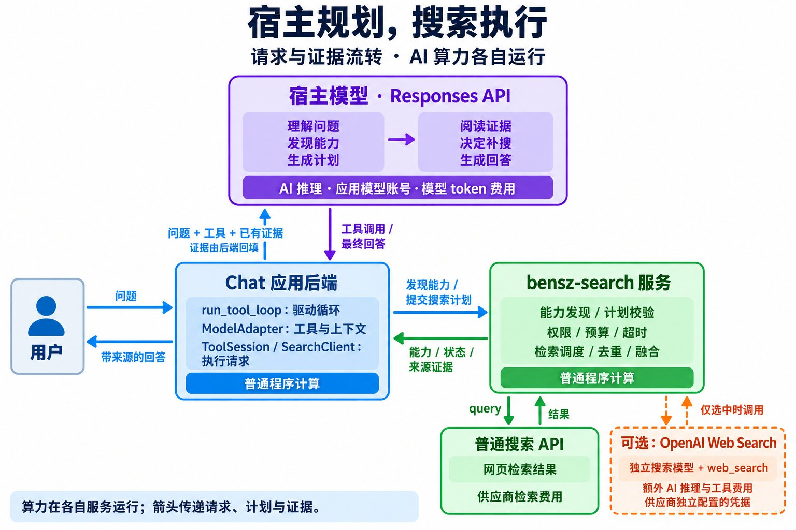

# 用宿主 Responses 模型规划搜索，用 bensz-search 执行搜索

本教程面向已经使用 OpenAI Responses API 的 Chat 应用开发者，解释“宿主的 Responses 模型负责思考和规划，bensz-search 负责执行搜索”如何通过函数工具实现，并给出可以复用现有项目代码的接入示例。

依据：2026-10-04 的项目源码，项目包版本 `1.0.0`，锁定的 upstream 为 **LiteLLM 1.103.2 发行包**；没有取得该发行包对应的 upstream Git commit。本文涉及的 Responses 消息适配和工具闭环已有离线验证，具体 OpenAI 模型与真实搜索的完整闭环仍待凭据验证。

## 先理解“宿主”与“算力流转”

宿主是使用 bensz-search 的 Chat 应用。宿主已有模型账号和模型调用代码，通过 Responses API 调用远端模型。应用将搜索工具注册给模型，让模型生成结构化操作，再由应用后端执行。

这里的“算力流转”指一次任务在不同服务之间交替进行计算。模型推理在模型供应商运行，工具循环在应用后端运行，检索调度与结果融合在 bensz-search 运行。它们通过 HTTP 传递问题、搜索计划与证据；模型权重和计算资源没有随请求迁移。

## 原理图：AI 在哪里思考，证据怎样返回



图中紫色代表宿主使用的远端模型推理，蓝色和绿色代表应用及搜索服务的普通程序计算，橙色虚线代表可选的供应商额外 AI 调用。箭头表示请求与数据的方向。

| 位置 | 执行的计算 | 调用凭据与费用 |
|---|---|---|
| 宿主调用的 Responses 模型 | 理解问题、选择工具、生成查询与计划、阅读证据、决定补搜、组织回答 | Chat 应用已有模型凭据；每轮模型调用产生模型费用 |
| Chat 应用后端 | 注册工具、解析完整调用、控制循环、发送搜索请求、回填结果与上下文 | bensz-search 应用 Key；后端 CPU、网络与运行成本 |
| bensz-search 服务 | 能力发现、权限与计划校验、规则路由、超时、熔断、去重和 weighted RRF 融合 | 服务端保存的供应商凭据；服务运行成本及供应商调用费用 |
| 普通搜索供应商 | 接收 query，返回检索结果 | 供应商搜索费用；项目通过搜索 adapter 调用，不推断供应商内部是否使用 AI |
| 可选的 OpenAI Web Search 供应商 | 另一次 Responses 调用，通过供应商搜索模型使用内置 `web_search` | bensz-search 后台独立配置的 OpenAI 凭据；额外模型 token 与工具费用 |

**搜索服务不会自动获得宿主的 OpenAI Key。** 宿主模型调用与搜索供应商调用的凭据、预算和上下文分别管理。即便两边都选用 OpenAI，它们也是独立 API 调用，供应商侧只接收检索所需的 query 与参数。

## 为什么模型能参与搜索

Responses API 的函数工具提供了三个衔接点：

- 请求中的 `tools` 告诉模型有哪些函数，以及每个函数接受什么 JSON 参数。
- 模型响应中的 `function_call` 告诉应用要调用哪个函数，并给出 `arguments` 和 `call_id`。
- 应用执行函数后，把结果作为 `function_call_output` 回填，使用同一个 `call_id` 关联调用与结果。

本项目提供两个逻辑工具：

| 工具 | 模型可以用它做什么 | 应用执行的 HTTP 请求 |
|---|---|---|
| `bensz_search_capabilities` | 发现当前 Key 有权使用的服务、已验证引擎、查询规则、预算与限制、能力 revision | `GET /bensz-search/v1/capabilities` |
| `bensz_search` | 提交 `auto` 查询，或提交模型生成的 `planned` 搜索计划 | `POST /bensz-search/v1/search` |

工具名称固定，供应商实例动态发现。比如 `exa-main` 是管理员创建的 `tool_id`，不能仅凭示例假设它已经存在。`engine_id` 也只能选择能力清单明确宣告、已验证可选的底层引擎。

宿主发送的可信工具规则要求模型先发现能力，再生成 planned 请求，复核执行状态和真实来源，必要时补充搜索。规则来自 [`tools.py`](../src/bensz_search/tools.py) 的 `INTERACTION_RULES`，由 Responses 适配器放入请求的 `instructions`。

这是模型参与规划的机制；是否需要搜索、查询拆分是否合理、能否发现证据缺口，仍取决于宿主模型的实际工具调用与推理能力。现有循环没有强制每个问题都必须搜索。

## 一次问题如何走完整个闭环

以“查找 Python 最新稳定版本，并评估升级依据”为例，下列是可能发生的过程，调用次数与选择的服务由模型决定。

### 把问题和工具送给宿主模型

`run_tool_loop` 建立输入历史，然后调用 `generate(adapter.request(history))`。`ModelAdapter("responses")` 生成包含 `input`、`instructions`、`tools` 的 Responses 请求。

函数工具使用 Responses 格式：`type`、`name`、`description`、`parameters`、`strict` 位于同一层。适配器从正式协议模型生成参数 Schema，展开引用并设置严格对象字段，应用无需手写供应商列表或复制另一份 Schema。

此时的 AI 推理发生在宿主配置的模型服务。Chat 后端只组织请求。

### 模型先发现可用搜索能力

模型可以返回如下调用：

```json
{
  "type": "function_call",
  "name": "bensz_search_capabilities",
  "call_id": "discover_1",
  "arguments": "{}"
}
```

`ToolSession.dispatch` 执行能力请求，将收到的 `registry_revision` 保存为本任务已交付的版本，再将能力清单回填给模型。能力发现本身不执行供应商搜索，也不调用搜索模型；后续让宿主模型阅读清单仍会产生模型 token 成本。

`SearchClient` 按客户端身份缓存能力快照，最长 30 秒。每个应用身份应使用自己的客户端，避免权限清单混用。

### 模型生成查询和 planned 计划

模型阅读能力后，可以决定分别查询官方发布说明、迁移文档与关键依赖兼容情况，并指定各查询使用哪个已发现的服务。

下列是 **HTTP 请求的简化示例**，省略了可用默认值的字段。它并非完整 Responses 严格工具参数样本；严格工具调用需按 `adapter.tools()` 生成的 Schema 填全必需字段。

```json
{
  "mode": "planned",
  "registry_revision": "从刚才的能力响应复制",
  "calls": [
    {
      "call_id": "release",
      "tool_id": "exa-main",
      "query": "Python latest stable release official release notes",
      "max_results": 3,
      "options": {"search_domain_filter": ["python.org"]}
    },
    {
      "call_id": "migration",
      "tool_id": "exa-main",
      "query": "Python latest stable version migration compatibility",
      "max_results": 3,
      "options": {"search_domain_filter": ["docs.python.org"]}
    }
  ],
  "constraints": {"latency_budget_ms": 15000, "cost_budget_usd": 0.02},
  "fusion": "weighted_rrf",
  "max_results": 6
}
```

只有能力清单中包含已启用且有权限的 `exa-main`，该示例才可执行。同一服务的两个查询有不同 `call_id`，是两项物理调用；同源族的结果不会因为重复查询获得额外的独立来源票。

改写 query 和拆分问题的工作发生在宿主模型。服务端将收到的 query 原样交给 adapter，不会再调用一个通用规划模型替你改写查询。

### 后端把调用交给搜索服务

`ToolSession` 在提交前检查本任务的联网开关、期限、搜索次数、剩余估算预算，以及 planned 请求是否使用已经发现的 revision。`SearchClient.search` 根据 `ProtocolSearch` 校验并发送请求，Bearer 应用 Key 只进入搜索请求头，不进入模型输入。

bensz-search 再独立校验 revision、Key/team 权限、工具与引擎、查询规则、调用上限和主调用估算费用。宿主校验不能替代服务端校验。过期能力返回 `stale_capabilities`，模型需要刷新能力并重新规划。

通过校验后，共用执行器调度供应商调用，控制并发、共用截止时间、费用预留和熔断，再归一化、过滤、去重与融合结果。

planned 模式只执行明确列出的主调用与 `fallbacks`；正常空结果默认不触发 fallback。自动补搜由宿主模型在收到结果后决定，不能假设服务端会执行计划之外的查询。

### 结果回填给模型，模型决定下一步

搜索响应包含 `status`、`results`、逐项 `execution`、来源、摘要类型、warning 和估算费用。应用将完整响应序列化，作为工具结果回填：

```json
{
  "type": "function_call_output",
  "call_id": "search_1",
  "output": "搜索响应序列化后的 JSON 字符串"
}
```

`call_id` 来自模型这一轮的 `function_call`，用于匹配工具结果；计划中 `calls[].call_id` 用于匹配各供应商物理调用，两者作用不同。

`ModelAdapter.append` 同时保留本轮完整 `response.output`，包括 reasoning 项和函数调用，再追加工具结果。仅回填一段摘要或只保留模型文本，会丢失模型继续推理和关联调用所需的上下文。

模型看到 `partial_success`、`no_results`、`failed` 或来源不足时，可以改写查询、换用另一个已授权服务或说明证据不足。结果充分时，模型返回不含函数调用的回答，循环结束。检索外部内容带有不可信数据边界，不能作为宿主系统指令；融合排名也不表示事实可信度。

## auto 与 planned 分别使用哪些计算

| 模式 | 查询与服务选择 | bensz-search 的工作 | 宿主模型的工作 |
|---|---|---|---|
| `auto` | 模型或宿主给出 query，服务端确定性规则选择服务和受限替代 | 规则路由、执行、融合、返回证据 | 决定是否调用、形成 query、阅读结果和回答；也可以继续补搜 |
| `planned` | 模型根据能力清单生成逐项查询、tool/engine 和可选 fallback | 校验计划、按声明执行、融合、返回证据 | 发现能力、规划各查询、评估缺口、调整计划和回答 |

两种模式都能在宿主模型循环中使用。区别是搜索执行计划由哪一方生成。`auto` 规则路由本身不额外调用通用 LLM planner；选中模型型搜索供应商时，该供应商仍可能产生独立 AI 调用。

## 接入准备

在 bensz-search 后台 **Search API** 添加供应商，完成真实连接测试并启用；然后在 **访问密钥** 页面为 Chat 应用创建 Key。详见[搜索 API 添加教程](search-api-setup.md)和[部署说明](deploy/README.md)。

以下示例在本项目根目录运行，复用现有 HTTP 模型传输器，无需额外安装 OpenAI SDK。准备项目环境：

```bash
sh scripts/uv.sh sync --extra dev
```

通过应用的环境注入机制设置以下变量。不要把真实凭据提交到仓库，也不要放进浏览器代码。

```dotenv
SEARCH_URL=http://127.0.0.1:8898
SEARCH_KEY=<bensz-search 后台生成的应用 Key>
EXISTING_MODEL_URL=https://api.openai.com/v1
EXISTING_MODEL_KEY=<Chat 应用已有的模型 Key>
EXISTING_MODEL_ID=<支持 Responses 函数调用且账号有权使用的模型 ID>
```

`SEARCH_URL` 填搜索服务根地址；`EXISTING_MODEL_URL` 填包含 `/v1` 的模型 API base。远程搜索服务使用实际 HTTPS 地址。模型供应商 Key 与 bensz-search 应用 Key 各自用于对应服务。

## 最小应用代码

将下面代码保存在项目任务工作区或你的 Chat 后端中，通过 `sh scripts/uv.sh run python <脚本路径>` 运行。它演示单次任务；多轮 Chat 会话需要应用另行管理历史。

```python
import asyncio
import os

from bensz_search.client import SearchClient, ToolSession
from bensz_search.model_adapters import ModelAdapter, run_tool_loop
from bensz_search.model_transport import HttpModel


async def main():
    async with SearchClient(os.environ["SEARCH_URL"], os.environ["SEARCH_KEY"]) as search:
        async with HttpModel(
            os.environ["EXISTING_MODEL_URL"],
            os.environ["EXISTING_MODEL_KEY"],
            os.environ["EXISTING_MODEL_ID"],
            "responses",
        ) as model:
            model_usage = []

            async def generate(payload):
                # 每次调用都使用 Chat 应用已有的模型账号。
                response = await model.generate({**payload, "max_output_tokens": 2048})
                model_usage.append(response.get("usage", {}))
                return response

            result = await run_tool_loop(
                generate,
                ModelAdapter("responses"),
                ToolSession(
                    search,
                    max_searches=3,
                    budget_usd=0.06,
                    duration_s=60,
                ),
                "搜索 Python 最新稳定版本，提供官方来源链接。",
                max_turns=8,
            )

            if result.get("status") == "failed":
                print("任务失败：", result.get("error"))
                return

            for item in result.get("output", []):
                if item.get("type") == "message":
                    for part in item.get("content", []):
                        if part.get("type") == "output_text":
                            print(part["text"])

            # 收集所有轮次，不能只统计最终回答那一次模型调用。
            print("模型请求次数：", len(model_usage))
            print("各轮模型 usage：", model_usage)


if __name__ == "__main__":
    asyncio.run(main())
```

这段代码各部分的职责：

| 代码 | 作用 |
|---|---|
| `generate` | 调用宿主的 Responses 模型；这里产生规划和回答的模型费用 |
| `ModelAdapter("responses")` | 生成函数工具、读取 function call、保留输出历史和回填结果；普通 Python 计算 |
| `ToolSession(search, ...)` | 每任务的搜索调度器，管理累计搜索限制；普通 Python 计算 |
| `SearchClient` | 用应用 Key 访问 bensz-search HTTP 协议；普通 HTTP 通信 |
| `run_tool_loop` | 重复“调用模型 → 执行工具 → 回填结果”，直至模型完成或达到限制 |

`HttpModel` 对 Responses 使用 `store=False`，并请求 `reasoning.encrypted_content`；适配器保留返回的完整 reasoning 项，供后续无状态请求继续使用。具体模型或兼容网关是否支持这些字段，需要实际验证。

如果应用已经使用 `AsyncOpenAI`，只需替换 `generate`，保留其他组件：

```python
async def generate(payload):
    return await openai.responses.create(
        model=os.environ["EXISTING_MODEL_ID"],
        **payload,
        store=False,
        include=["reasoning.encrypted_content"],
        max_output_tokens=2048,
    )
```

此处的 `openai` 是应用自己创建并管理生命周期的 `AsyncOpenAI` 客户端。循环接受 SDK 返回的对象，也接受 HTTP JSON 字典。SDK 示例需要应用自行安装 `openai` 并配置自己的模型凭据。

## 已有 Chat 工具循环时怎样接入

应用已经管理其他工具、流式展示和多轮历史时，可复用 `ModelAdapter.tools()` 注册这两个搜索工具，以及 `ToolSession.dispatch(name, arguments)` 执行调用。

在你的完整循环中，对本轮所有函数调用分别执行并收集结果，随后保留完整 `response.output`，再回填对应的 `function_call_output`。应用已有的其他工具使用原有 dispatcher。不要把其他工具的调用送给只处理搜索的 `ToolSession`。

合并应用系统说明与项目 `INTERACTION_RULES`，并保留联网授权、外部内容不可信及来源复核规则。`run_tool_loop` 每次创建新的单任务历史；会话持续上下文由宿主维护，不能把每条消息都当成完全独立的新任务后期待它自动记住之前的聊天。

Responses 流式输出需等待完整响应再执行工具。现有 `assemble_stream` 接受解析后的流事件，只有收到 `response.completed` 才交付完整响应；不要在函数参数 JSON 尚未拼接完整时提交搜索。工具完成后可继续流式生成回答，具体前端事件由宿主处理。

## 限制和费用怎样累计

| 配置 | 当前含义 | 需要注意 |
|---|---|---|
| `max_turns=8` | 一次 `run_tool_loop` 最多发起 8 轮模型请求 | 包含发现、计划、补搜和回答；不是 8 次供应商检索 |
| `max_searches=3` | 正常执行并返回的搜索请求累计最多 3 次 | 能力发现、dry run 和被拒绝的无效计划不计为执行搜索；一项请求可有多项物理调用 |
| `budget_usd=0.06` | 本任务累计搜索估算预算，后续请求按剩余值收紧 | 默认每请求估算预算仍为 `$0.02`；宿主模型费用单独统计，估算不是供应商账单保证 |
| `duration_s=60` | 从创建 session 开始计算的共用任务期限 | 包含模型思考、能力发现、搜索与补搜；每请求也受服务端及供应商超时约束 |
| `max_output_tokens=2048` | 示例对每轮模型输出设置的上限 | 不是总输入 token 或总费用上限；推理模型的输出预算需结合模型行为验证 |

同一项 planned 请求最多声明 10 项物理调用，包括 fallback；服务端默认并发为 3。失败调用与替代调用也可能收费。客户端遇到搜索超时后返回 `outcome_unknown` 并耗尽本任务的搜索预算，不会自动重放可能已经付费的请求。

同一任务跨轮复用 session，才能累计搜索预算和次数。若要跨多条用户消息累计限制，需要应用定义会话级预算与存储；当前 session 是内存对象，且有固定期限。

函数工具调用依然会产生宿主模型费用；`dry_run` 只保证搜索服务不执行供应商检索，不保证整个模型交互免费。示例在 `generate` 中收集每轮 `usage`，实际费用需按所用模型和供应商的计费规则汇总。

生产应用还应在宿主入口处理模型服务的 HTTP 异常、鉴权失败和用户取消。当前工具循环没有把所有模型网络异常转换为统一的搜索错误 envelope，也没有提供宿主模型的严格美元预算控制。

## 怎样确认接入确实发生了规划

调试时观察三个阶段：

- **模型侧**：出现 `bensz_search_capabilities`，随后出现 `bensz_search`，其 arguments 为 `mode: planned`，包含实际发现的 revision 和 tool/engine ID。
- **搜索侧**：返回的 `execution` 对应计划中的物理调用；`results[].sources` 能定位实际服务、引擎和原始排名。HTTP 200 仍可能包含 `status: failed`，必须检查业务状态。
- **回填侧**：下一轮模型输入同时保留上一轮模型输出与匹配 `call_id` 的工具结果；模型的最终链接可以在结果来源中找到。

如果模型提交 `auto`，说明采用了服务端规则路由；模型仍可负责查询形成和答案综合，但不能把这次调用记成“模型逐服务规划已验证”。没有函数调用而直接回答，也不能记成已检索。

测试应分别标明：mock 模型验证工具协议、mock 搜索验证宿主消息回填、真实搜索验证供应商、真实模型与真实搜索共同验证完整闭环。当前版本的具体模型验收状态见[兼容矩阵](smart-search-router/protocol/compatibility.md)。不要将本文示例理解为某个真实模型已经通过生产验收。

## 实现位置与进一步阅读

| 文件与关键符号 | 可以核对的实现 |
|---|---|
| [`tools.py`](../src/bensz_search/tools.py)：`logical_tools`、`INTERACTION_RULES` | 两个逻辑工具与可信交互规则 |
| [`model_adapters.py`](../src/bensz_search/model_adapters.py)：`ModelAdapter`、`run_tool_loop`、`assemble_stream` | Responses Schema、工具循环、上下文回填与流式完成条件 |
| [`client.py`](../src/bensz_search/client.py)：`SearchClient`、`ToolSession` | 能力缓存、HTTP 请求、累计限制与超时处理 |
| [`model_transport.py`](../src/bensz_search/model_transport.py)：`HttpModel` | 宿主模型 HTTP 调用、无状态推理上下文 |
| [`protocol.py`](../src/bensz_search/protocol.py)：`capabilities`、`search` | 服务端能力发现、planned/auto 校验与执行入口 |
| [`executor.py`](../src/bensz_search/executor.py)：`execute` | 供应商调用、并发、费用预留、超时和 fallback |
| [`openai_search.py`](../src/bensz_search/openai_search.py)：`search` | 可选供应商侧 Responses `web_search` 调用 |
| [`test_model_adapters.py`](../tests/test_model_adapters.py) | 离线发现→计划→执行→回答，以及上下文、预算和异常场景 |

- [完整搜索协议与接口](smart-search-router/protocol/README.md)
- [中文接入指南](smart-search-router/protocol/integration.zh-CN.md)
- [现有模型接入示例](../examples/model_search.py)
- [供应商侧 OpenAI Web Search](smart-search-router/openai-web-search.md)
- [OpenAI 官方 Function calling 文档](https://developers.openai.com/api/docs/guides/function-calling)，2026-10-04 实际读取，用于核对工具调用与结果回填格式。

原理图由 auto-draw-plot 的 `general` 模式经 BenszAPI 生成；图展示实现职责和计算边界，运行细节以本文和源码为准。
