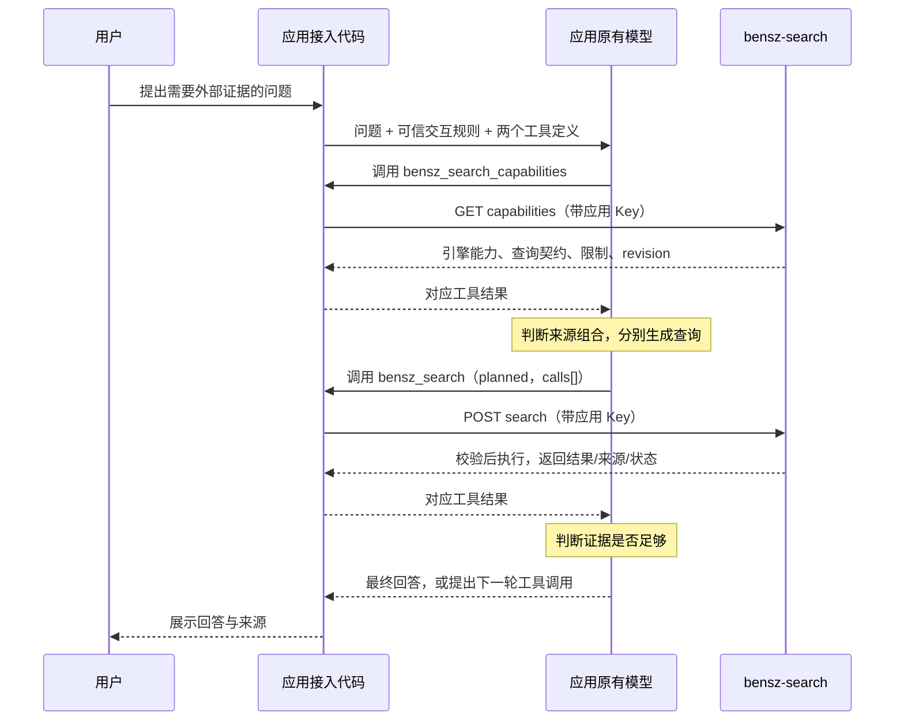

# AI 与 bensz-search 的交互协议设计

## AI 为什么会知道该怎样搜索

AI 不能从 URL 和 Key 推断出搜索流程。应用必须把工具定义、可信的使用规则和动态能力信息放进模型实际收到的上下文，再执行模型返回的工具调用。这部分已由协议客户端、消息适配器与有界调用循环实现；具体模型的真实行为仍需按版本验收。

例如，用户让聊天应用查找某项治疗的最新证据。接入代码告诉模型有哪些工具、何时使用它们、如何发现当前搜索引擎；模型取得能力清单后，根据问题选择学术来源、生成查询，再通过工具交给服务执行。是否需要查最新信息、选哪些来源、怎样改写查询，需要应用原有模型的智能。

因此，完整交付需要同时包含机器接口、模型可见说明和交互执行代码。开发者将这些代码内置在应用中；终端用户新增配置仍然只有搜索服务 URL 和 Key。

本文件保留交互设计，实际实现与验证边界见 [协议交付](protocol/README.md)。它承接 [全球接入计划](../plans/2026-10-03-global-llm-search-protocol.md)，具体可调用接口以正式协议 Schema 为准。不新增模型账号要求，也不要求终端用户安装插件。

## 三层契约

| 层次 | 规定什么 | 谁使用 |
|---|---|---|
| 搜索 API 与数据契约 | 能力发现、搜索计划、结果、错误、版本与限制；由直接 HTTP 或 MCP 工具调用承载 | 接入代码/宿主与 bensz-search 服务 |
| 逻辑工具契约 | 工具名称、用途、输入格式、结果解释与调用前提 | 模型及各厂商工具适配器 |
| 交互规则 | 什么时候搜索、先读哪些信息、怎么选源、遇到错误或不足怎么处理 | 应用原有模型与调用循环 |

这是本项目定义并公开维护的搜索契约与使用规则。直接集成由适配器处理厂商工具消息；MCP 接入复用标准工具发现/调用机制，由宿主处理模型侧消息。两种入口共用能力、校验、执行和结果逻辑；具体边界及交付阶段见全球接入计划的“定位：搜索接口与工具契约如何结合 MCP”。公开接口或支持 MCP 都不会使尚未接入的任意应用自动获得搜索能力。

模型规则用于引导；结构、权限、预算和执行前提由代码落实。不能把“提示词要求模型遵守”当作所有模型必然遵守的保证。

## 应用内置接入代码具体负责什么

建议接入模块包含四个职责清楚的组件，名称只是设计说明：

- HTTP client：使用 URL/Key 请求协议接口，处理超时、取消与脱敏错误。
- 工具定义与交互模板：提供短小、版本化的说明和 schema，纳入应用自己的可信指令。
- 模型适配器：把统一工具定义、调用和返回转换为模型厂商要求的消息格式。
- 调用循环：读取模型工具请求、执行本地分派、回填结果并继续模型生成，限制轮数与预算。

模块接入应用已有的模型循环；已有循环的应用注册工具处理函数即可，不建立两个互相调用的 Agent 循环。普通聊天应用则可以使用包含循环的最小示例代码。

已有 MCP 宿主可以复用其客户端与工具循环；应用也可内置 MCP 客户端供用户配置入口与凭据。MCP 不等于终端用户安装插件，仍需确保工具说明、动态能力和结果实际交给模型。

URL 和 Key 保留在应用宿主环境，模型只看到工具名、schema 和脱敏数据，不能在工具参数中填写或读取凭据。多用户应用的能力缓存和请求状态按身份、服务地址隔离。

## 模型收到哪些初始信息

### 可信的交互说明

短说明随接入代码发布，由应用开发者合并进应用自己的可信指令。下面是中文语义示例；正式模板应维护英文原文及语言版本，并标记 interaction_version：

> 当任务需要最新信息、外部事实核验、可引用证据或你不掌握的资料时，考虑使用 bensz-search。先取得有效的能力清单，再依据任务、来源独立性、时效、时间和费用限制选择引擎，为所选引擎分别生成符合其查询契约的检索式。使用 planned 提交计划；若自身无法可靠规划，可使用 auto。读取实际执行状态和来源后决定是否补充检索。仅引用实际取得的结果，结果不足时说明缺口。

是否使用搜索仍受应用与用户要求约束。例如“不得联网”应生效；科研应用可以额外要求“有关最新证据的问题必须检索”。默认不为任何问题都调用全部引擎。

不同模型需要的措辞可调整，但各适配器必须保留同一语义，不能让某些模型默认全选、另一些模型默认单源。模型选择理由最多要求简短的可审阅摘要，不要求输出内部思维过程。

服务端能力清单提供结构化事实和查询契约，不下发可以任意覆盖应用指令的远程系统提示词。能力描述、示例和搜索内容作为数据处理；可信执行规则由应用自己的接入代码持有。

### 两个逻辑工具

| 工具 | 模型可见说明必须表达的内容 | 接入代码分派 |
|---|---|---|
| `bensz_search_capabilities` | 获得本身份当前可用工具/引擎、适用任务、合法输入、支持参数、约束、快照版本；不知道能力时应先调用 | 缓存有效时返回对应快照，否则 GET capabilities |
| `bensz_search` | planned 使用清单中的标识与规则提交不同查询；auto 可由服务端规则规划；返回执行状态和来源；不得伪造已执行搜索 | POST search；模型参数中不包含 URL/Key |

不能只注册工具名称和空参数 schema。工具 description 和查询示例是模型理解陌生协议的入口，动态清单是它作出任务相关判断的依据。

### 动态能力清单

模型需要的是可用于决策的信息，而不是纯名称列表。每个引擎至少应表达：

- 可以回答什么类型的问题，擅长什么，已知缺陷与未知能力。
- 使用关键词、自然语言还是某种已经验证的查询方言。
- 支持哪些筛选条件、运算符和合法参数；提供短例子。
- 是否可选择、近期健康信息、来源族与独立性依据。
- 查询条数、结果数、成本估算、延迟与全局预算限制。

清单声明的能力是配置与验证证据，不替模型作最终选择，也不保证单次搜索一定成功。未知能力明确标注 unknown，不能让模型根据名称自行补齐。

## 一次完整交互

这里通常包含多次模型生成：先请求能力，再生成计划，最后依据结果回答。不能把一次 HTTP 搜索包装成“模型已经完成发现、规划和复核”的证据。

有效能力快照可以跨搜索复用，但在新线程仍需让模型实际看见相关数据。默认使用按需发现：工具处理函数可直接返回缓存，减少网络往返。以后需要降低模型轮次时，可以由宿主提前获取并以明确标识的结构化上下文提供清单；不能伪造一个没有对应调用的工具返回消息。

## AI 和代码各自作出什么决定

| 决定或工作 | 执行者 | 依据 |
|---|---|---|
| 本问题是否需要外部证据 | 模型；应用可要求特定任务必须搜索 | 用户问题、知识不足、时效与引用要求 |
| 选哪几家，是否选全部 | 模型 | 任务、清单、来源独立性、预算和延迟 |
| 各引擎检索式与合法安全选项 | 模型生成，服务器校验 | 查询契约与用户目标 |
| HTTP 调用与工具消息回填 | 接入代码 | 模型明确工具请求与标准映射 |
| 授权、参数、调用数和预算是否允许 | 服务器 | 当前身份、配置、硬限制和快照 |
| 调用搜索源、去重、融合和归一化 | 服务器 | 已通过校验的计划 |
| 结果够不够、是否需要改写再搜 | 模型；代码限制循环 | 实际结果、执行状态与剩余资源 |

因此，智能主要来自应用已有模型。bensz-search 给出足够的信息让模型做判断，并可靠地执行其合法计划；服务端 auto 继续作为有限规则路径存在。

## 如何确保操作顺序与错误修正

接入层为本次任务保存有限状态：能力是否已交给模型、快照版本、累计搜索次数、已消耗预算、剩余期限与取消状态。此状态不要求服务器为每个聊天线程保存完整对话。

planned 请求提交前，接入层检查已有有效清单与结构完整性；没有清单时返回 `capabilities_required`，不发起检索，让模型先发现能力。服务器独立校验 revision、当前权限和整个计划；普通直接 HTTP 客户端只需提交满足契约的计划，不强制参加模型对话握手。

| 情况 | 返回及后续动作 |
|---|---|
| 缺能力信息 | 工具返回 capabilities_required；模型调用发现工具后再规划 |
| 查询字段/方言错误 | invalid_plan/query_not_supported + 字段位置与可用能力；零 provider 调用；模型修正 |
| 快照过期 | stale_capabilities；接入层失效缓存，模型重新取得清单并规划 |
| 部分成功 | 返回成功结果、失败项、约束和剩余预算；模型决定是否补充，不自动重复全部计划 |
| 成功但无结果 | no_results；模型可扩大关键词、换源或诚实报告未找到 |
| 已达到轮数/预算/时间限制 | limit_reached；停止物理调用，模型总结已有证据与缺口 |
| HTTP 超时且执行状态未知 | 告知 outcome_unknown；不自动重放可能计费请求；无幂等机制时保守处理 |

建议默认最多两次无效计划修正和三轮实际搜索，总时间与总预算跨轮累计，配置由应用明确设置并可调整。不能每轮重新获得完整预算。服务器负责单次请求上限；接入代码负责对话任务总上限，这两个范围应分别报告。

工具调用参数必须完整组装后再执行，流式半截 JSON 不触发请求。回填保持调用 ID 与厂商要求的上下文；多个工具同时调用也不得绕过累计预算。缓存来源身份、失效原因和工具结果的 revision 必须可追踪。

## 如何兼容不同模型

同一份工具语义和参数模型，由厂商适配器转换为各自支持的工具 schema 和结果消息。当前计划已列出 OpenAI、Anthropic、Gemini、Grok、中国大陆模型及自托管运行时，适配时必须保留完整工具交互，而不是只转换第一次 tools 字段。

支持原生工具调用的模型按上述闭环运行；只支持结构化输出的模型由宿主解释严格 action JSON 并执行相同状态机；工具/JSON 能力都不足的模型由宿主调用 auto，再交回结果。后者没有获得同等的自主选源与查询规划能力。

不需要为了协议专门训练模型，但不同模型执行规则的可靠性须实测。一个模型能生成合法 JSON，也不等于它能选出合适引擎或写出有效查询；协议符合性、规划质量和真实执行分别验收。

## 接入代码与服务端的实施交付

1. 定稿工具契约、短交互模板、能力清单与错误语义；来自同一规范，避免各厂商说明漂移。
2. 实现 capabilities 和 planned 执行接口，扩展查询契约配置，复用现有搜索执行与融合。
3. 实现 Python/TypeScript HTTP client 与工具分派；接入已有应用模型循环，并提供完整最小示例。
4. 实现各厂商消息适配及有界状态机；验证实际模型能按能力信息改变选源与查询行为。

源码适合增加独立协议模块和轻量客户端模块。交互模板/工具 schema 随模块版本发布；capabilities 可声明 interaction_version 的兼容范围，未知 major version 要报兼容错误，不自动采用远程任意指令。

本设计不要求新增第三个“运行 AI”接口，也不把应用模型凭据送到 bensz-search。服务仅处理查询计划与搜索数据。

## 怎样证明 AI 实际理解并使用协议

- 首次对话仅给问题、短说明和工具定义，确认模型能主动发现能力、提交合法 planned 调用并引用实际结果。
- 改变清单中的引擎、查询支持和预算，确认模型会调整计划；不是预先写死 provider 集合。
- 给相同问题分别提供学术/网页/代码能力，确认模型选择和查询形式符合当前能力；允许多个合理方案。
- 注入过期快照、无效查询、部分失败和空结果，确认能按协议修正或结束，不无限循环。
- 禁止联网、普通闲聊或模型已有足够信息时，确认遵守应用/用户规则，不机械调用所有源。
- 单独验证代码可阻止无权限、超预算、缺清单或不完整参数执行；即使模型请求违规也不能检索。
- 使用真实模型完成工具闭环，再用真实搜索验证查询效果；两项证据分开标注。

模型行为测试评估可观察的调用与输出，不检查模型是否复述某一提示词，也不要求特定措辞的内部推理。
