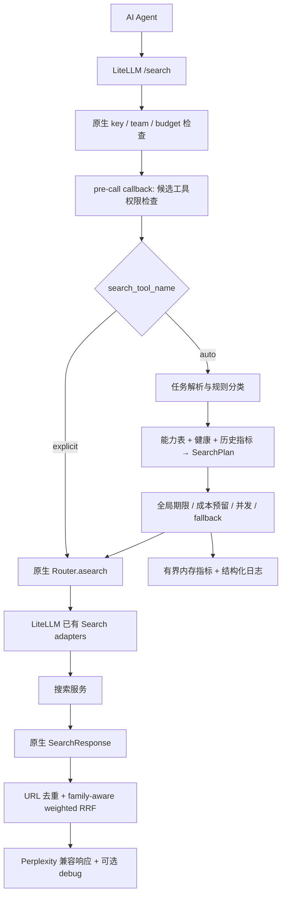

# bensz-search 第一版设计

基础方案对应 0.1。0.2 按用户要求增加登录后台与持久化管理，当前部署见 [部署说明](../deploy/README.md)；下文“无 UI/数据库”是第一阶段历史边界，现以轻量静态后台与 SQLite 扩展。

## 0.2 后台与运行配置

`server.py` 保留原生 proxy，新增 `/admin` 静态后台和 `/admin/api` 会话接口；浏览器入口引导后台，原生 POST 搜索继续运行。`admin_store.py` 持久化用户、provider、session 和应用 key：密码使用 scrypt、key/session 使用哈希、provider 凭据用独立环境密钥加密。

`admin.py:AdminRuntime.refresh()` 建立新的 LiteLLM Router/Registry，并更新授权 callback；后续请求立即使用保存的设置，已执行请求持有旧 Router 完成。配置变更重置熔断，复用 telemetry。SearXNG 按实际选定引擎建立 academic/coding/news 映射，避免混合引擎顺序将代码结果排到学术查询前列。

后台 session 与原生 API token 分离。管理员管理配置/用户，成员只搜索和管理自己的 key。`managed_api_auth()` 为原生 custom-auth 接点，显式限制自有 key 到搜索 POST 路由，返回全部启用工具的权限，复用原生 adapter 和回调。自有身份持久化由 SQLite 实现，不宣称原生 LiteLLM DB virtual-key/spend 已验收，也不提供每用户账单系统。

生产模式禁用 demo key/fixture，可在无 provider 时启动后台配置；`/ready` 返回 503。范围为单实例本地 Docker，不配置远程服务器。

## 用户可观察的行为

研究 Agent 搜索 ctDNA 临床证据时，系统可同时查询语义检索源和网页源，把同一论文合并并保留出处。查询一个确切的文档时通常只调用一个工具。所有选择均有解释；无需为了每次选择先付一次 LLM 费用。

## 架构与请求流

当前 LiteLLM：HTTP → 身份/工具权限 → 公共处理 → Router 同名选择/retry/fallback → Search adapter → 统一结果。

新增扩展位于公共处理与 provider 调用之间：

## 数据模型

- `SearchTask`：query（string/list）、intent（auto/general/news/academic/deep/people/coding）、domain、freshness、authority_requirement、recall_requirement、precision_requirement、semantic_requirement、source_diversity、latency_budget_ms、cost_budget_usd、result_count、caller_profile。
- `SearchRequest`：保留原生统一参数，加 profile/profile_prompt/constraints/debug/fusion。profile_prompt 第一版仅以规则解析已知词汇，并在 debug 说明，不声称可以理解任意自然语言。其余预留意图不默默伪装为支持，输入验证返回 422。
- `ProviderCapabilities`：name、真实 provider 标识、source_family、各能力 [0,1]、features、quality、cost/latency class、单调用预算估计和超时。能力数值是可调先验，不是经过实验证明的质量排名。
- `SearchPlan`：single/parallel、weighted provider entries、fallback 候选、fusion、timeout_ms、max_cost、routing_reason。
- `SearchResultFeedback`：request_id、event、result_url（可选）。MVP 只记录有界内存聚合，不训练模型。

## 路由算法

1. 显式指定 provider 时由原生 Router 处理，不触发智能分类。
2. auto 优先结构化 profile，其次 profile_prompt，最后 query 词汇规则。支持中文和英文触发词；deep_research/scientific_research 等 profile type 映射到 MVP 意图。
3. 排除未配置/无权限/熔断/高于预算的候选。按意图适配、semantic/keyword、freshness、authority、质量、历史成功率、观测延迟、cost class 评分；相同 source_family 施加重复来源惩罚。
4. 通用/精确请求默认一个；academic/news/people 或高召回默认两个；deep 最多三个。cost=low 或 latency=low 限制为一个。不会默认并发六个源。
5. 时间和成本为所有主请求与 fallback 共享的上限。预算估计包含 query list 的数量；调用前原子预留，失败可能计费，因此也消耗预算。没有资格的 fallback 不执行。

Layer 1+2 是可解释规则和评分；未来的 LLM planner 是接口方向，不在 MVP 中额外调用 LLM。历史指标是进程内有界 EWMA，重启清空。

## 融合、去重与来源相关性

none 保留首个顺序；rrf 使用等权；weighted_rrf 使用 plan 权重。rank 从 1 开始，k=60。

独立 family 的贡献相加；同一个 family 对同一文档的贡献取最大值：

`score(d) = Σ_family max_{provider in family} weight(provider)/(60+rank(provider,d))`。

它比简单除以全家 provider 数量更直接地避免三家 Google API 产生三个独立票，同时保留某个 provider 独有的结果。SearXNG 是聚合源，默认使用保守 family 配置；管理员应按实际 engines 改写，不能假设绝对独立。

URL 去 fragment、常见 tracking、规范 host/www/default port/query 排序；保留 path/query 大小写和分页/id。可靠 canonical_url（若 provider 返回）用于同文不同 URL；相同域名标题高度接近且路径/参数结构兼容时才合并，防止分页或同名文章误删。不抓取任意文档来推测 canonical，不额外引入 SSRF/延迟。

freshness 使用 provider 参数映射并后过滤可解析日期；硬 freshness 请求不接受缺失日期的结果。authority 高只做能力偏好和解释，无法保证文献质量。保留 domain filter 并进行统一后过滤，以补足 SearXNG adapter 不支持统一域名过滤的问题。

## 错误、fallback 与熔断

区分 timeout、auth、quota、rate_limit、unavailable、invalid_response、empty、bad_request。auto 不在同一 provider 上立即重试；auth/quota 立即进入长冷却，其余临时故障达到阈值后短冷却。半开状态只允许一条探测请求。

主请求并行，各失败分支从有序 fallback 中领取未尝试工具；不重复调用已在另一分支执行的工具。全局期限到期取消子任务，有结果时返回部分成功；全部失败返回脱敏 502，纯预算或无候选为 503。调用参数错误停止该分支，避免无意义 fan-out。

## 可观察性与成本

默认结果仍为 object/results；debug=true 加 task、plan、provider attempts、failure category、latency、result_count、estimated cost、贡献、overlap、marginal gain。结构化日志不保存 query/profile_prompt/凭据。原生 provider 调用继续使用 LiteLLM callback，继承 user/team metadata。

debug 成本明确区分 **配置预估** 与 provider/LiteLLM 已知实际费用；估算不能替代供应商账单。每次物理请求独立 call id，逻辑请求共享 router request id；不给 aggregate 重复触发 spend callback。进程内统计不替代持久化 spend/virtual-key 数据库。

## 配置与 API 兼容

原生 `search_tools` 配置管理真实凭据；独立 `capabilities.yaml` 描述能力，不保存 key。默认 YAML 仅启用已配凭据的工具；`auto` 为逻辑工具别名。支持 `/search`、`/v1/search` 及路径参数形式。query-only 在原生入口前补默认工具，因此鉴权也看到最终 tool。显式请求完整透传，保留原生 provider-specific 参数、错误及 fallback 行为。

auto 仅转发统一安全参数；客户端不能覆写 credentials、base URL、headers、retries/fallbacks 或内部 caller metadata。反馈和指标接口也使用原生身份鉴权。

## Docker 与 upstream 同步

Python 3.11、固定 LiteLLM 版本、依赖 lock；单容器运行原生 FastAPI proxy，无 UI/数据库。默认 loopback 发布端口。demo profile 增加隔离的 fixture provider 服务，真实部署从环境变量读取 keys 和 SearXNG URL。

升级流程：更新版本 → 重新审计 endpoint/Router/callback/lifespan/response model → 运行单元和 proxy 集成/benchmark → Docker demo。适配层保持在 `integration.py`；算法模块不 import proxy 内部类型。未来 hook 足够时替换此适配层。第一版不 fork：没有 upstream diff 要合并。
